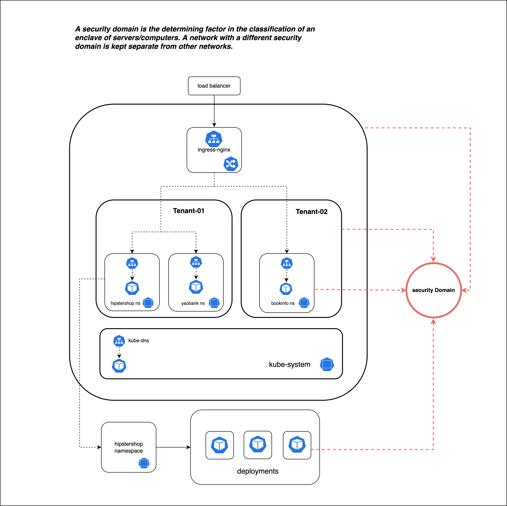
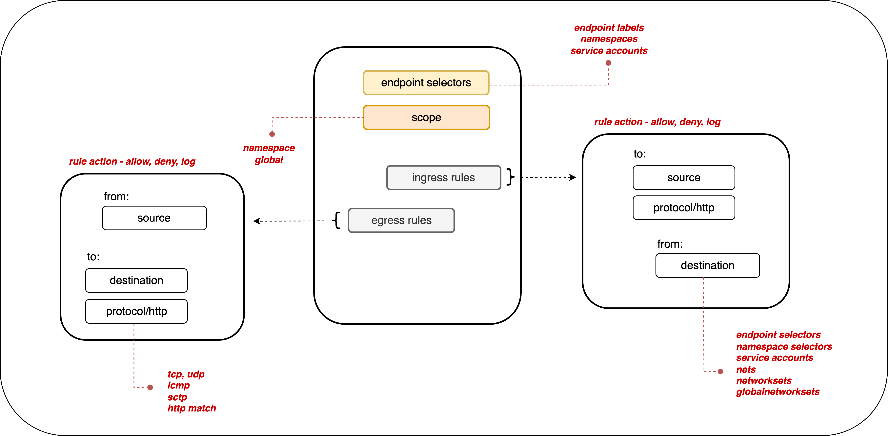

# Microsegmentation

This guide will walk Kubernetes users how to approach and implement segmenting their environment with network policies to achieve different levels of security granularity, depending on the requirement to segment at a cluster, tenant, namespace or workload level.

## Overview
Microsegmentation is a network security technique that allows organizations to divide their networks into smaller segments than might have been secured with legacy firewall approaches that target perimeters. This approach is used to enhance the security and control of a network by limiting communication between different segments which has the benefit of isolating critical workloads, preventing lateral movement of threats, and meeting compliance requirements.

In Kubernetes, this is implemented using network policies that allow for different levels of granularity to secure workloads, applications, namespaces, or clusters. Network policies are the tool of choice for achieving network security over traditional firewalls due to their ability to apply to Kubernetes objects based on label selectors and not IP addresses, which are often dynamic and ephemeral. 


Microsegmentation has the advantage of scalability. As networks or clusters grow and evolve, identity-aware microsegmentation (leveraging Kubernetes selectors) allows for the addition of new segments without disrupting or exposing the existing network infrastructure.  

When organizations need to segment and isolate their Kubernetes environments this is typically done at three different levels: [Workload Isolation](https://www.tigera.io/blog/enabling-microsegmentation-with-calico-enterprise-2/), [Namespace Isolation](https://www.tigera.io/blog/automated-namespace-isolation-with-calico/) and [Tenant Isolation](https://www.tigera.io/blog/deep-dive/implementing-tenant-isolation-in-multi-tenant-kubernetes-clusters/).

<details>
<summary>Workload Isolation </summary>
Kubernetes network policy is defined to secure specific microservices within a tenant or namespace. Isolating individual workloads helps further reduce the attack surface and prevents lateral movement between workloads or potential performance issues.
A network policy designed for workload isolation contains more restrictive ingress and egress rules, only allowing essential communication between microservices.
For example, an application may contain frontend and backend workloads within the same namespace. If the frontend is public, and more likely to be breached, apply a microsegmentation strategy where communication between the frontend and backend is restricted. If the frontend is compromised, the likelihood of the malicious actor obtaining sensitive information from the backend is significantly reduced. Perimeter (namespace) security approach is inadequate in this situation.
</details>

<details>
<summary>Namespace Isolation </summary>
In Kubernetes, namespaces are used to separate different software applications or processes from each other by assigning them unique namespaces. This helps to prevent conflicts or interference between different applications that may be running on the same system, and owned by different users. 
Isolating and securing applications in their namespaces means developers can ensure that their software operates independently and securely without the ability to impact other namespaces in the cluster. If one application in a namespace is compromised, having secured and isolated namespaces reduces and contains the “blast radius” of that threat. 
</details>

<details>
<summary>Tenant Isolation </summary>
When cluster infrastructure is shared between tenants there may be an organizational or compliance  requirement for isolation. A tenant may contain several resources, including workloads or namespaces (secured or unsecured), and still require that perimeter security apply to the context of the tenant.
This protects each tenant from lateral movement at an infrastructure level where a malicious or opportunistic actor may seek to obtain or steal high value assets, damage or misuse applications. If one tenant is compromised, the risk to other tenants on the same infrastructure is significantly reduced.
</details>

## Reference Architecture

Before implementing a segmentation strategy in a cluster there are a few key high-level concepts that must be understood.
These are:
Security Domains
Network Security
Default Deny

If you are a Calico Enterprise or Calico Cloud user there are more features available that enable a faster and easier microsegmentatione experience.


### Security Domains

Anyone implementing microsegmentation and zero-trust should first identify all of the security domains that need to be secured. A security domain could be:

**Cluster**: The cluster can be considered a security domain. 

**Tenants**: Each tenant can be considered a separate security domain. A tenant may be comprised of a team or individuals that share the same Kubernetes infrastructure. It is a collection of applications or namespaces for which a specific security declaration is enforced.

**Namespaces**: Microservices that make up an application are typically organized into a single namespace and can be treated as separate security domains. For example, consider protecting an application from other applications in the cluster or the same tenant.

**Endpoints** A microservice comprises endpoint groups such as deployments, statefulsets, and daemonsets. Microservices, even in the same namespace, must be protected from each other to limit the blast radius if one is compromised. For example, consider a frontend and a backend microservice in the same namespace; they are in separate security domains and must be protected by security policies.



### Network Security
Successful segmentation is achieved by implementing network policies that secure security domains at the correct granularity depending on an organization's security posture or compliance requirements.

Calico’s network policies provide a richer set of policy capabilities than Kubernetes including: 
- policy ordering/priority, 
- deny rules, 
- more flexible match rules
- can be applied to multiple endpoints: pods, VMs, and host interfaces. 

There is a more detailed list of Calico network policy features available [here](https://docs.tigera.io/calico/latest/network-policy/get-started/calico-policy/calico-network-policy#features). The Kubernetes documentation outlines what network policies [do](https://kubernetes.io/docs/concepts/services-networking/network-policies/) and [do not](https://kubernetes.io/docs/concepts/services-networking/network-policies/#what-you-can-t-do-with-network-policies-at-least-not-yet) support.

Calico Open Source integration with Istio providers application security, and service mesh. This integration enables layers 5-7 security policy match criteria, end to end mTLS encryption and cryptographic identity. For more information read [this blog](https://www.tigera.io/blog/how-to-build-a-service-mesh-with-istio-and-calico/)

Calico security policies are:
- Declarative - define security intentions in yaml (or through the Create Policy UI in Calico Cloud or Calico Enterprise)
- Label-based - security policies apply to endpoints based on workload identity using label selectors. These can be combined into larger expressions using multiple operators and parentheses.
- Dynamic - Security policies are tightly coupled with workloads based on their identity, not ever-changing IP addresses



All Calico products support label-based policies that can be applied to either a namespace or cluster-wide (global) scope.

In Kubernetes clusters, by default, without any policies in place, each microservice is allowed to communicate with each other, and with any external endpoints freely.

## Default Deny

It is recommend to create a [default deny](https://docs.tigera.io/calico/latest/network-policy/get-started/kubernetes-default-deny) policy for your Kubernetes pods. This guarantees that if no other policy is defined that explicitly allows traffic to/from a pod, then the traffic will be denied.

Note that an implicit default deny policy always occurs last; if any other policy allows the traffic, then the deny does not come into effect. The deny is executed only after all other policies are evaluated.

A global default deny policy avoids needing to define a policy every time a namespace is created. It also forces tenants of the cluster to define a network policy for every new pod. However, ensure you have the correct allow policies in place to ensure control plane traffic does not get blocked.


### Additional Functionality with Calico Enterprise and Calico Cloud

Calico Cloud and Calico Enterprise extend network policy capabilities and usability to support hierarchical tiered network policy, automatic network policy recommendations (including automatic namespace isolation) based on existing flows, and integrations with third party firewalls.
Network policies can be viewed and managed through a user interface, with the ability to stage and preview policy impact before enforcement.

Calico Open Source users may want to read this [blog](https://www.tigera.io/blog/how-to-integrate-kubernetes-rbac-and-calico-to-achieve-shift-left-security/).

This enables users to manage policies at scale leading to more efficient management and implementation of a microsegmentation strategy.

The diagram below shows an example of how policies for different security domains are grouped and organized into tiers with Calico Cloud or Enterprise.


#### Global vs Namespace Policies

Calico supports global network policy (GlobalNetworkPolicy); a non-namespaced resource containing rules which are applied to any endpoints (pods, VMs, host interfaces) that match a label selector.
Network policy is a namespaced resource that only applies to workload endpoint resources (pods, containers, VMs) within that namespace. 

#### Network Policy Management
In Calico, you can use the order field (with precedence from the lowest value to highest) to control how policies are applied and evaluated. Defining policy order is important when you include both ```action: allow``` and ```action: deny``` rules that may apply to the same endpoint.
If no network policies apply to a pod, then all traffic to/from that pod is allowed. 
If one or more network policies apply to a pod containing ingress rules, then only the ingress traffic specifically allowed by those policies is allowed. 
If one or more network policies apply to a pod containing egress rules, then only the egress traffic specifically allowed by those policies is allowed.

Calico Cloud and Calico Enterprise allow hierarchical grouping of policies into tiers. Policy Tiers allow enforcement of higher-precedence policies that cannot be circumvented by other teams. Policy tiers are evaluated based on order, as are policies within each tier. Graphically, policies are evaluated from left to right, top to bottom. RBAC for each tier can be defined to restrict who can interact with each tier.

While Calico Open Source does not support policy tiers, you can use RBAC to control how different users can shape cluster security.

## Implementation

Implementing microsegmentation should be done in a variety of stages. 

First, identify the security domains for which microsegmentation will be enforced and who will be responsible for them. 

Second, [define a policy](https://docs.tigera.io/calico-enterprise/latest/network-policy/beginners/) model using documented microservice communication for your application(s) or by analyzing traffic flows. 

Third, [deploy security policies](https://docs.tigera.io/calico-enterprise/latest/network-policy/staged-network-policies). Once all of the correct allow policies are in place, enforce a [default deny posture](https://docs.tigera.io/calico-enterprise/latest/network-policy/default-deny). You may want to identify a low-impact implementation first to understand and evaluate the process before prioritizing segmentation of critical security domains.

Fourth and last, re-assess any flows or new applications that may require policy remediation before implementing a default-deny.

### Identification

When identifying security domains or applications to secure, you may also want to consider application criticality and compliance requirements. 
This will be unique to your organizational requirements and security posture.
Starting with a low-risk implementation allows you to de-risk the process before applying it to business critical security domains.

For more information on meeting compliance requirements beyond microsegmentation, review one of our [whitepapers](https://www.tigera.io/resources/?_sft_types=white-paper&_sft_Resource_Topics=compliance).

### Developing Policy Framework

#### Analyzing Traffic

To define a policy model, you need to know what the expected communication is within a security domain and design policies to protect those domains.
You may need to consider:
- [Will you use global or namespaced policies?](https://docs.tigera.io/calico-enterprise/latest/network-policy/policy-best-practices#use-global-network-policy-only-when-all-rules-apply-globally)
- [Do you need to protect hosts (and configure that)?](https://docs.tigera.io/calico-enterprise/latest/network-policy/hosts/)
- [Who is responsible for defining policies for different security domains?](https://docs.tigera.io/calico-enterprise/latest/network-policy/policy-best-practices#determine-who-can-write-policy)
- [What order should policies be applied in?](https://docs.tigera.io/calico-enterprise/latest/network-policy/policy-tiers/policy-tutorial-ui#policy-ordering)
- And [Tier](https://docs.tigera.io/calico-enterprise/latest/network-policy/policy-tiers/policy-tutorial-ui#tiers), for Calico Cloud or Enterprise users.

Policy models may be easier to produce if an application has documentation stating how microservices communicate over which protocols and ports. A ‘shift left’ approach also puts the onus on individuals who are more familiar with communication dependencies and can define accurate policy.

If you’re using Calico Open Source and struggling to analyze traffic flows, you may find it easier to install a text scraping tool (Fluent Bit) and pass log information to a text processing software (Elastic). This would enable Open Source users to see layer 2-3 logs and build policies from that.

Calico Cloud and Enterprise users have multiple tools available to analyze flows:
[Dynamic Service and Threat Graph](https://docs.tigera.io/calico-cloud/tutorials/calico-cloud-features/tour#service-graph) is a topographical visualization of workload communication. Through this feature, you can access flow logs that show metadata for source and destination endpoints, as well as any policies that apply to the flow and the outcome.
[Flow Visualization](https://docs.tigera.io/calico-cloud/tutorials/calico-cloud-features/tour#service-graph) shows volumetric flow data within the cluster in a 360’ view. FlowViz, in addition to Service Graph, allows users to see what flows exist within a cluster or namespace, metadata and selectors associated with endpoints and any applied policies.
[Elasticsearch and Kibana](https://docs.tigera.io/calico-cloud/tutorials/calico-cloud-features/tour#logs) are included with [Calico Cloud](https://docs.tigera.io/calico-enterprise/latest/visibility/kibana) and [Calico Enterprise](https://docs.tigera.io/calico-enterprise/latest/visibility/kibana) that enables users to explore Elasticsearch logs and gain insights into workload communication traffic volume, performance, and other key aspects of cluster operations. Log data is also summarized in custom dashboards.

#### Creating Policies

You may want to review the best practices for network policies in: [Calico Open Source](https://docs.tigera.io/calico/3.26/about/kubernetes-training/about-network-policy#best-practices-for-network-policies), [Calico Enterprise](https://docs.tigera.io/calico-enterprise/3.17/network-policy/policy-best-practices#policy-best-practices-for-day-one-zero-trust), [Calico Cloud](https://docs.tigera.io/calico-cloud/tutorials/training/about-network-policy#best-practices-for-network-policies).

[Calico Cloud](https://docs.tigera.io/calico-cloud/network-policy/policy-tiers/policy-tutorial-ui#create-a-network-policy) and [Calico Enterprise](https://docs.tigera.io/calico-enterprise/3.17/network-policy/policy-tiers/policy-tutorial-ui#create-a-network-policy) have a ‘Create Policy’ GUI to create, edit and delete policies. Policies that have been created in the GUI can be downloaded as YAML.

[If you need to limit traffic to/from external non-Calico workloads or networks you can use external IPs or network rules.](https://docs.tigera.io/calico-enterprise/3.17/network-policy/beginners/policy-rules/external-ips-policy)

Calico Cloud and Calico Enterprise also support [automatic policy recommendations](https://docs.tigera.io/calico-enterprise/latest/network-policy/recommendations/policy-recommendations) that automatically generate network policy to isolate namespaces. Policy recommendations can also be generated for specific namespaces or workloads for a more granular segmentation strategy.

Policy Recommendations makes it easier and faster for platform operators to implement namespace isolation at scale or without experience in authoring network policies or detailed knowledge of how application workloads are communicating. Calico analyzes the flow logs that are generated from workloads, and automatically recommends and stages policies for each namespace that can be used for isolation.

All recommended polices are staged by default. This allows you to preview the impact of a policy without impacting traffic flow, to assess the effectiveness of a policy, or to evaluate any unintended side-effects.
[Policy recommendations need to be enabled](https://docs.tigera.io/calico-enterprise/3.17/network-policy/recommendations/policy-recommendations#activate-and-review-policy-recommendations) per cluster and may take time to learn and analyze flows before providing recommendations.

### Deploy Security Policies

In all products, policies can be applied using the CLI.
You can check if policies have been applied:

```
kubectl get networkpolicy
kubectl describe networkpolicy <networkpolicy-name>
```

When applying policies you will need to apply policies in such an order that it does not impact applications.

With [Calico Open Source](https://docs.tigera.io/calico/3.26/network-policy/get-started/calico-policy/calico-network-policy#apply-network-policies-in-specific-order) you may want to define the policy order in the policy spec in addition to applying policies in the correct order.

Calico Enterprise and Calico Cloud feature hierarchical tiers that are visible on the Policies Board.

It is important to understand how [policy endpoints match across tiers](https://docs.tigera.io/calico-enterprise/3.17/network-policy/policy-tiers/tiered-policy#policy-endpoint-matching-across-tiers).

### Enforce Default Deny

A global default deny policy ensures that unwanted traffic (ingress and egress) is denied by default. Pods without a policy (or incorrect policy) are not allowed traffic until an appropriate network policy is defined. 

Note that Global Calico Network Policies are not namespaced and affect all pods that match the policy selector. In contrast, Kubernetes Network Policies are namespaced, so you would need to create a default deny policy per namespace to achieve the same effect.

[Calico Open Source: Enable default deny for Kubernetes pods](https://docs.tigera.io/calico/3.26/network-policy/get-started/kubernetes-default-deny)

In Calico Cloud and Calico Enterprise the [staging policy](https://docs.tigera.io/calico-enterprise/3.17/reference/resources/stagednetworkpolicy) tool will help you find incorrect and missing policy; a global deny helps mitigate against other lateral malicious attacks.

We recommend that you create a global default deny policy after you complete writing policy for the traffic that you want to allow. Use the stage policy feature to get your allowed traffic working as expected, then lock down the cluster to block unwanted traffic. The following steps summarize best practice:

- Create a staged global default deny policy. It will show all the traffic that would be blocked if it were converted into a deny.
- Create other network policies to individually allow the traffic shown as blocked in step 1, until no connections are denied.
- Convert the staged global network policy to an enforced policy.

### Monitor, Review, Refine

In the last step, new traffic flows are introduced to the application workloads to assess the impact and remediate any defunct security policies.

You can do this by deploying test pods inside different namespaces within the cluster to test connections to different endpoints to verify that the security policies are in place correctly.

In Calico Cloud or Calico Enterprise, the policies board will be the first sign of misconfigurations, making it easy to spot policies that are denying traffic or have no endpoints assigned to them.

Additionally, refer to the section on analyzing flows. This will be useful to use logs and observability to identify denied traffic that may need investigation or remediation.
